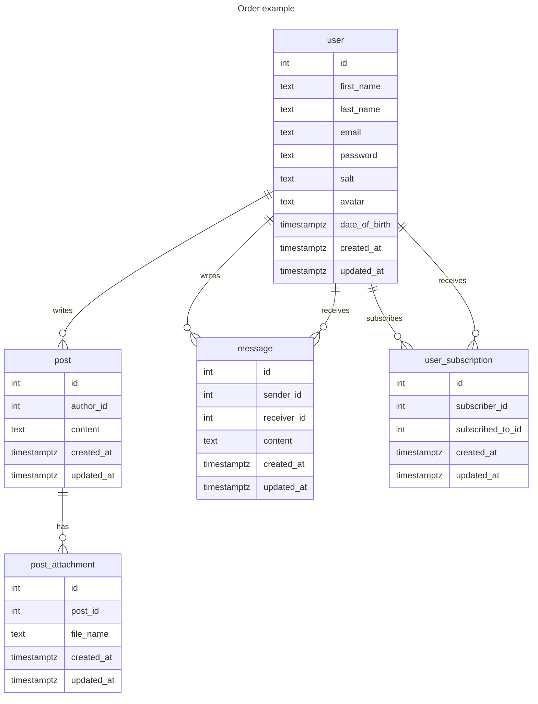

```mermaid
---
title: Order example
---
erDiagram
    user ||--o{ post : writes
    user||--o{ message : writes
    user||--o{ message : receives
    user||--o{ user_subscription : subscribes
    user||--o{ user_subscription : receives
    user {
        int id
        text first_name
        text last_name
        text email
        text password
        text salt
        text avatar
        timestamptz date_of_birth
        timestamptz created_at
        timestamptz updated_at
    }

    post ||--o{ post_attachment : has
    post {
        int id
        int author_id
        text content
        timestamptz created_at
        timestamptz updated_at
    }

    post_attachment {
        int id
        int post_id
        text file_name
        timestamptz created_at
        timestamptz updated_at
    }
    
    message {
        int id
        int sender_id
        int receiver_id
        text content
        timestamptz created_at
        timestamptz updated_at
    }

    user_subscription {
        int id
        int subscriber_id
        int subscribed_to_id
        timestamptz created_at
        timestamptz updated_at
    }
```   