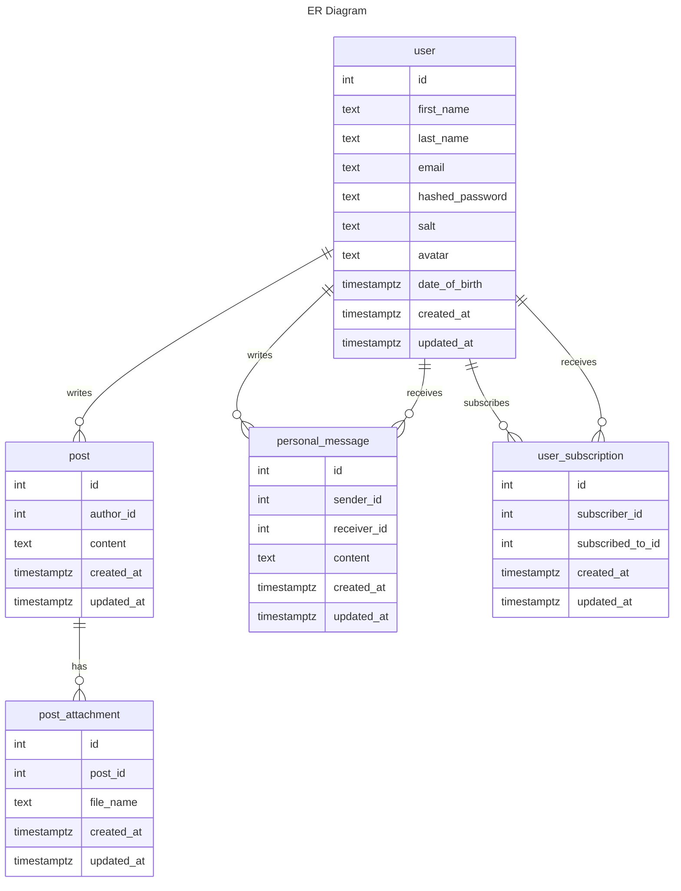

<h4>Отношение user</h4>
<h5>ФЗ</h5>

    {id} -> email, first_name, last_name, hashed_password, salt, date_of_birth, avatar, created_at, updated_at

    {email} -> id, first_name, last_name, hashed_password, salt, date_of_birth, avatar, created_at, updated_at
    
<h5>Соответствие НФ</h5>
<ul>
    <li>1НФ - не используются составные типы данных.</li>
    <li>2НФ - все неключевые атрибуты неприводимо зависят от первичного ключа id.</li>
    <li>3НФ - все неключевые атрибуты нетранзитивно зависят от первичного ключа, нет транзитивных зависимостей, в частности, все данные об авторе поста вынесены в отдельную таблицу.</li>
    <li>НФБК -  каждая нетривиальная и неприводимая слева функциональная зависимость обладает потенциальным ключом в качестве детерминанта. В данном случае потенциальный первичный ключ один, поэтому отношение соответствует НФБК, т. к. оно находится в 3НФ.</li>
</ul>

<h4>Отношение post</h4>
<h5>ФЗ</h5>

    {id} -> author_id, content, created_at, updated_at
    
<h5>Соответствие НФ</h5>
<ul>
    <li>1НФ - не используются составные типы данных.</li>
    <li>2НФ - все неключевые атрибуты неприводимо зависят от первичного ключа id.</li>
    <li>3НФ - все неключевые атрибуты нетранзитивно зависят от первичного ключа, нет транзитивных зависимостей, в частности, все данные об авторе поста вынесены в отдельную таблицу.</li>
    <li>НФБК -  каждая нетривиальная и неприводимая слева функциональная зависимость обладает потенциальным ключом в качестве детерминанта. В данном случае потенциальный первичный ключ один, поэтому отношение соответствует НФБК, т. к. оно находится в 3НФ.</li>
</ul>

<h4>Отношение personal_message</h4>
<h5>ФЗ</h5>

    {id} -> sender_id, receiver_id, content, created_at, updated_at

<h5>Соответствие НФ</h5>
    <ul>
        <li>1НФ - не используются составные типы данных.</li>
        <li>2НФ - все неключевые атрибуты неприводимо зависят от первичного ключа id.</li>
        <li>3НФ - все неключевые атрибуты нетранзитивно зависят от первичного ключа, нет транзитивных зависимостей, в частности, все данные об авторе и получателе сообщения вынесены в отдельную таблицу.</li>
        <li>НФБК -  каждая нетривиальная и неприводимая слева функциональная зависимость обладает потенциальным ключом в качестве детерминанта. В данном случае потенциальный первичный ключ один, поэтому отношение соответствует НФБК, т. к. оно находится в 3НФ.</li>
    </ul>

<h4>Отношение user_subscription</h4>
<h5>ФЗ</h5>

    {id} -> subscriber_id, subscribed_to_id, created_at, updated_at'

    {subscriber_id, subscribed_to_id} -> id, created_at, updated_at

<h5>Соответствие НФ</h5>
    <ul>
        <li>1НФ - не используются составные типы данных.</li>
        <li>2НФ - все неключевые атрибуты неприводимо зависят от первичного ключа id.</li>
        <li>3НФ - все неключевые атрибуты нетранзитивно зависят от первичного ключа, нет транзитивных зависимостей, в частности, все данные об подписчике и том, на кого подписаны, сообщения вынесены в отдельную таблицу.</li>
        <li>НФБК -  каждая нетривиальная и неприводимая слева функциональная зависимость обладает потенциальным ключом в качестве детерминанта. В данном случае потенциальных первичных ключа два, и две присутствующих ФЗ зависят только от этих потенциальных ключей.</li>
    </ul>

Relation post_attachment
<h5>ФЗ</h5>

    {id} -> post_id, file_name, created_at, updated_at
    
    {file_name} -> id, post_id, created_at, updated_at

<h5>Соответствие НФ</h5>
    <ul>
        <li>1НФ - не используются составные типы данных.</li>
        <li>2НФ - все неключевые атрибуты неприводимо зависят от первичного ключа id.</li>
        <li>3НФ - все неключевые атрибуты нетранзитивно зависят от первичного ключа, нет транзитивных зависимостей, в частности, все данные об подписчике и том, на кого подписаны, сообщения вынесены в отдельную таблицу.</li>
        <li>НФБК -  каждая нетривиальная и неприводимая слева функциональная зависимость обладает потенциальным ключом в качестве детерминанта. В данном случае потенциальных первичных ключа два, и две присутствующих ФЗ зависят только от этих потенциальных ключей.</li>
    </ul>

