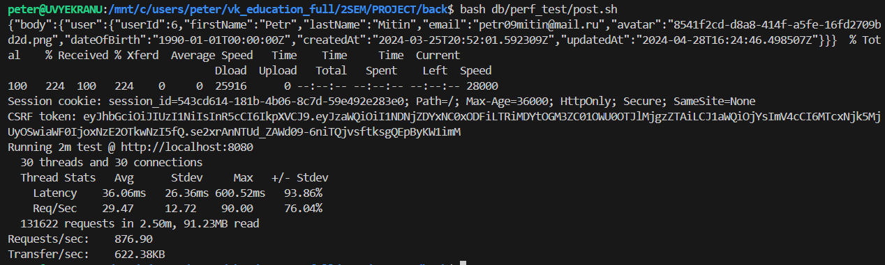

<h1>СУБД ДЗ3</h1>
<h3>VKPogromisty - Митин Пётр, Алексей Горбунов</h3>

    Для тестирования был выбран инструмент wrk.

 

    Тестируемая сущность - посты, тестируемые  хэндлеры API - создание поста (POST /api/v1/posts/) и получение новых постов (GET /api/v1/posts/new).

<h4>Создание постов</h4>

    Сначала создадим ~10^5 записей в БД. Для этого с помощью curl пройдем аутентификацию, получим CSRF-токен и с помощью wrk создадим записи. Скрипты создания записей представлены в файлах get.sh и get.lua.

    Результаты тестирования представлены на рисунке 1.

    
    Рисунок 1 - Результаты тестирования создания постов

    Оптимизировать процесс создания поста можно, если денормализовать отношение post, добавив в него массив вложений post_attachments вместо отдельной таблицы post_attachment, чтобы избежать операции JOIN с post_attachment. Это решение не подойдет в случае, если нам потребуется хранить о вложении какую-либо информацию помимо имени файла и id поста, например, дату и время добавления.

<h4>
    Получение постов
</h4>

    Аналогичным образом пройдем аутентификацию и протестируем получение постов. Результаты представлены на рисунке 2.

    
    Рисунок 2 - Результаты тестирования получения постов

    Оптимизировать процесс получения постов можно: 
        <ol>
            <li>Денормализовав post_attachment аналогично созданию поста</li>
            <li>Добавив в таблицу post столбец group_post_id, чтобы избежать операции JOIN с таблицей group_post</li>
            <li>Добавив индекс по столбцу created_at для ускорения сортировки<li>
        </ol>

